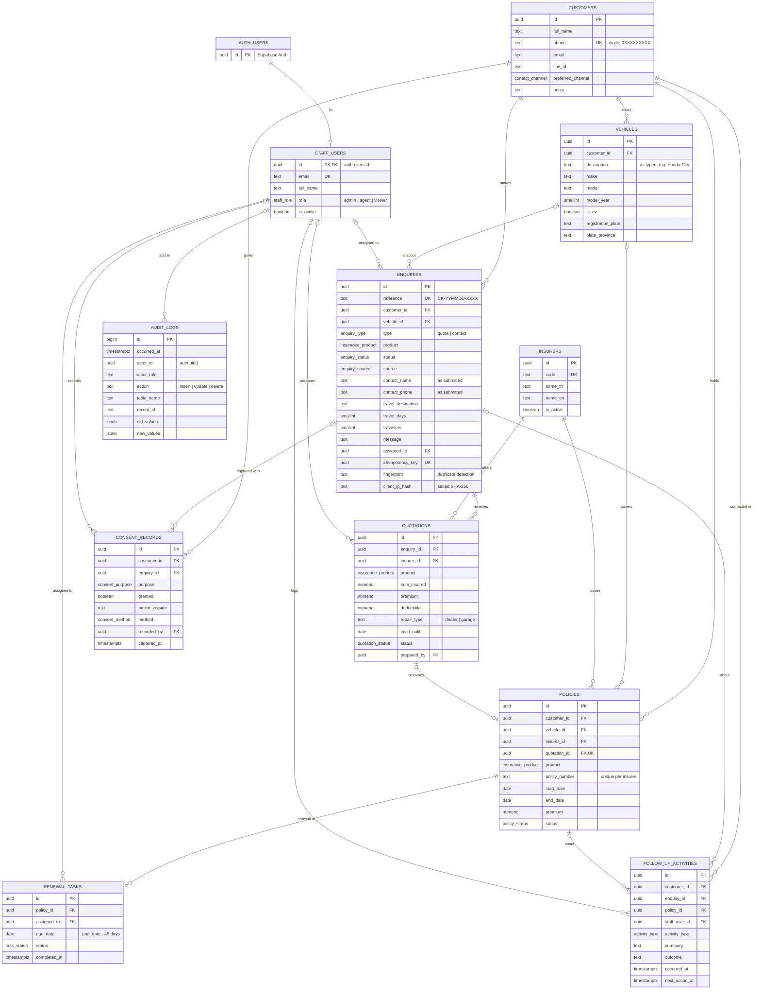
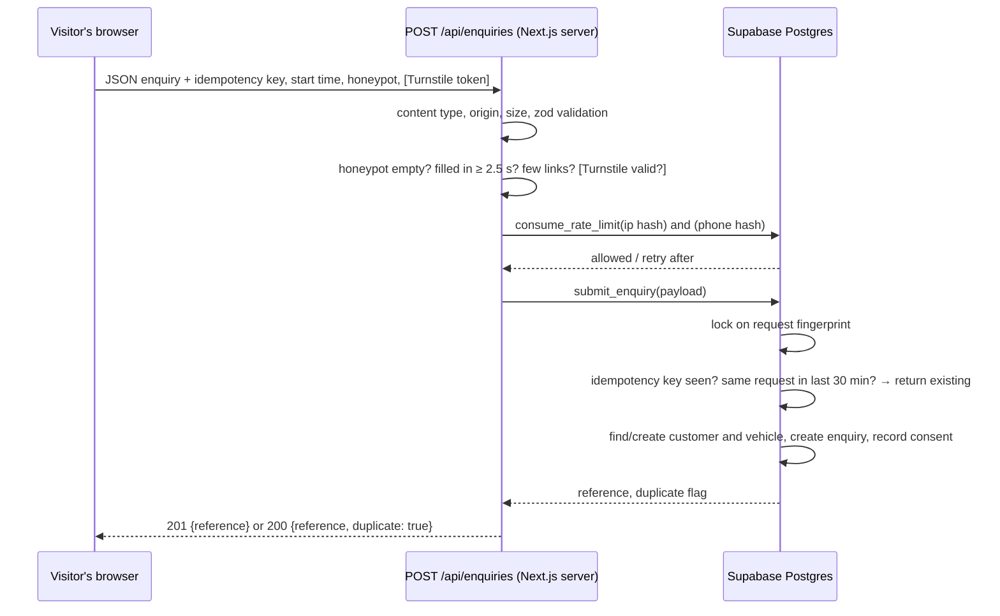

# CheckKhum customer database

Supabase PostgreSQL. Schema changes live in versioned migrations in
[`supabase/migrations/`](../supabase/migrations); never edit a migration that
has been applied. Add a new one with `npx supabase migration new <name>`.

| Migration | Contents |
|---|---|
| `20261005060000_base_types_and_helpers.sql` | Enum types, `private` schema, `updated_at` and append-only trigger functions |
| `20261005060100_core_tables.sql` | The 11 tables, constraints, indexes, rate-limit table |
| `20261005060200_audit_and_automation.sql` | Audit-log triggers; automatic renewal tasks |
| `20261005060300_access_control.sql` | Grants, row level security policies, staff role helpers |
| `20261005060400_enquiry_intake.sql` | `submit_enquiry` and `consume_rate_limit` (server only) |

## Entity relationship diagram

Rendered copy: [`database-erd.png`](database-erd.png).



Every table also has `created_at`, and mutable tables have `updated_at`
(maintained by trigger). The non-exposed `private.rate_limit_buckets` table
backs rate limiting and holds only salted hashes.

### Design notes

- **One customer per phone number.** Web enquiries are matched to customers by
  phone. The public form never overwrites an existing customer's details;
  what the visitor typed is kept on the enquiry (`contact_name`, `contact_phone`).
- **Consent is append-only evidence.** Each web enquiry records
  `quote_processing` (granted) and the visitor's `marketing` choice, with the
  privacy notice version shown. A withdrawal is a new row with
  `granted = false`. Updates and deletes are blocked by trigger for every
  role.
- **Audit logs** are written by triggers on every customer table: who
  (`auth.uid()` and database role), what, and for updates only the changed
  columns. They cannot be edited or deleted, even with the secret key.
- **Renewal tasks** are created automatically 45 days before a policy ends
  when it becomes `active`.
- **Deletion.** Customers with enquiries, policies, consent records or
  activities cannot be deleted (`on delete restrict`). Handle PDPA erasure
  requests as a deliberate admin process (anonymise the record), not a
  cascade.
- **Not stored:** national ID numbers, dates of birth, raw IP addresses.
  Add sensitive fields only with a lawful basis and a migration that also
  updates the privacy notice.

## Access control

Row level security is enabled on every table. Supabase's default grants to
`anon` and `authenticated` are revoked explicitly before granting only what
each role needs.

| Who | How they connect | customers, vehicles, enquiries, quotations, policies, follow-ups, renewal tasks | insurers | consent records | staff users | audit logs | `submit_enquiry`, `consume_rate_limit` |
|---|---|---|---|---|---|---|---|
| Public visitor | Publishable key (`anon`) | none | none | none | none | none | none |
| Signed-in user not in `staff_users` (or inactive) | `authenticated` | none | none | none | none | none | none |
| Staff: viewer | `authenticated` | read | read | read | read | none | none |
| Staff: agent | `authenticated` | read, add, edit | read | read, add (phone/LINE/paper only) | read | none | none |
| Staff: admin | `authenticated` | read, add, edit, delete | full | read, add | full | read | none |
| Website server | Secret key (`service_role`) | bypasses RLS | | | | | execute |

Visitors create enquiries only through `POST /api/enquiries` on the website
server, which calls `submit_enquiry` with the secret key. Because `anon` cannot
execute that function, the endpoint's validation, spam checks and rate limits
cannot be skipped by calling Supabase directly.

## Enquiry intake flow



| Protection | Where | Limit |
|---|---|---|
| Validation | `src/lib/server/enquiry-validation.ts` + table constraints | Thai phone, lengths, ranges, known plans |
| Honeypot field | form + endpoint | must be empty |
| Minimum fill time | form + endpoint | 2.5 s |
| Link spam | endpoint | no links in name; fewer than 3 in message |
| Cloudflare Turnstile | form + endpoint | optional, on when keys are set |
| Rate limit per IP | `consume_rate_limit` | 5 per 10 minutes |
| Rate limit per phone | `consume_rate_limit` | 5 per hour |
| Idempotency key | `enquiries.idempotency_key` unique | double-clicks, retries |
| Same-request window | `submit_enquiry` fingerprint | 30 minutes |
| Concurrency | advisory lock on fingerprint | identical parallel requests |

## Testing

```bash
npm run db:start          # local Supabase (Docker)
npm run db:reset          # apply migrations + fictional seed
npm run db:test           # pgTAP: 42 access-control and intake assertions
npm run db:lint
npm run build && npm start                          # with .env.local → local Supabase
BASE_URL=http://localhost:3000 npm run verify:enquiries   # 31 end-to-end API checks
```

`verify:enquiries` refuses to run unless Supabase is local, because it
creates rows.

Seed logins (local only, password `checkkhum-local-only`):
`admin@checkkhum.example`, `agent@checkkhum.example`, `viewer@checkkhum.example`.
