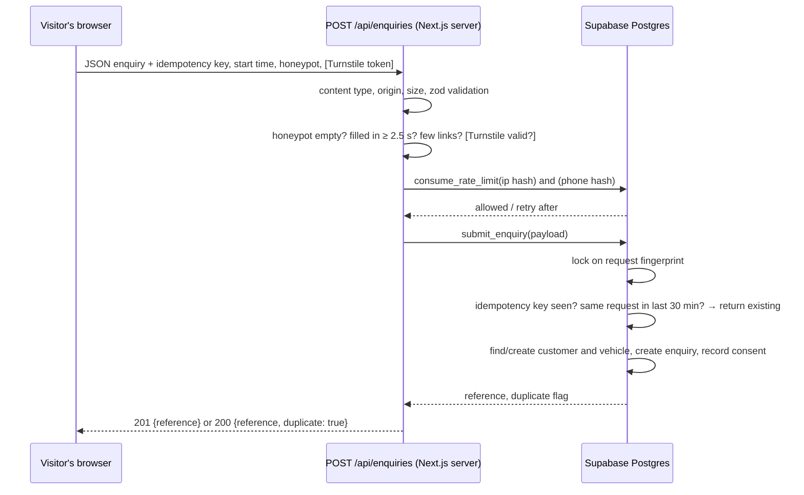

# CheckKhum customer database

Supabase PostgreSQL. Schema changes live in versioned migrations in
[`supabase/migrations/`](../supabase/migrations); never edit a migration that
has been applied. Add a new one with `npx supabase migration new <name>`.

| Migration | Contents |
|---|---|
| `20261005060000_base_types_and_helpers.sql` | Enum types, `private` schema, `updated_at` and append-only trigger functions |
| `20261005060100_core_tables.sql` | The 11 tables, constraints, indexes, rate-limit table |
| `20261005060200_audit_and_automation.sql` | Audit-log triggers; automatic renewal tasks |
| `20261005060300_access_control.sql` | Grants, row level security policies, staff role helpers |
| `20261005060400_enquiry_intake.sql` | `submit_enquiry` and `consume_rate_limit` (server only) |
| `20261006090000_crm_workflow.sql` | Pipeline rules, status history, follow-up tasks, author stamping, customer search, conversion report, quotation → policy |
| `20261006090100_renewal_job.sql` | Scheduled renewal job (pg_cron), staff reminders, job run log; replaces the renewal trigger |
| `20261008090000_customer_portal_enum.sql` | Enquiry source `customer_portal` (own migration: a new enum value can't be used in the same transaction) |
| `20261008090100_customer_portal.sql` | Customer portal: invitations, account links, policy documents + private storage bucket, portal functions, renewal requests |
| `20261010090000_line_login.sql` | LINE Login: `customer_line_accounts` (one LINE user per login), server-only `line_login_user()` / `link_line_account()`, LINE invitation links (`create_line_invitation()`, `accept_invitation_token()`), profile source `line` |
| `20261011090000_quote_details.sql` | Quote form v2: `enquiries.renewal_timing` (fixed list) and `enquiries.details` (small JSON object of product answers: usage, repair, EV home charger, พ.ร.บ. vehicle type, trip start); `submit_enquiry` stores brand and model in `vehicles.make` / `vehicles.model` and no longer creates an empty vehicle for พ.ร.บ./travel requests |
| `20261009090000_customer_self_registration.sql` | Self-registration: `customer_profiles` (trigger on `auth.users` + idempotent fallback), `portal_session()`, enquiries submitted while signed in, `portal_overview()` for unlinked logins |

## Entity relationship diagram

Rendered copy: [`database-erd.png`](database-erd.png).

```mermaid
erDiagram
    AUTH_USERS ||--o| STAFF_USERS : "is"
    CUSTOMERS ||--o{ VEHICLES : owns
    CUSTOMERS ||--o{ ENQUIRIES : makes
    VEHICLES |o--o{ ENQUIRIES : "is about"
    STAFF_USERS |o--o{ ENQUIRIES : "assigned to"
    ENQUIRIES ||--o{ QUOTATIONS : receives
    INSURERS ||--o{ QUOTATIONS : offers
    STAFF_USERS |o--o{ QUOTATIONS : prepares
    CUSTOMERS ||--o{ POLICIES : holds
    VEHICLES |o--o{ POLICIES : covers
    INSURERS ||--o{ POLICIES : issues
    QUOTATIONS |o--o| POLICIES : "becomes"
    POLICIES ||--o{ RENEWAL_TASKS : "renewal of"
    STAFF_USERS |o--o{ RENEWAL_TASKS : "assigned to"
    CUSTOMERS ||--o{ FOLLOW_UP_ACTIVITIES : "contacted in"
    ENQUIRIES |o--o{ FOLLOW_UP_ACTIVITIES : about
    POLICIES |o--o{ FOLLOW_UP_ACTIVITIES : about
    STAFF_USERS |o--o{ FOLLOW_UP_ACTIVITIES : logs
    CUSTOMERS ||--o{ CONSENT_RECORDS : gives
    ENQUIRIES |o--o{ CONSENT_RECORDS : "captured with"
    STAFF_USERS |o--o{ CONSENT_RECORDS : records
    STAFF_USERS |o--o{ AUDIT_LOGS : "acts in"
    ENQUIRIES ||--o{ ENQUIRY_STATUS_HISTORY : "moves through"
    STAFF_USERS |o--o{ ENQUIRY_STATUS_HISTORY : changes
    CUSTOMERS ||--o{ FOLLOW_UP_TASKS : "has"
    ENQUIRIES |o--o{ FOLLOW_UP_TASKS : about
    POLICIES |o--o{ FOLLOW_UP_TASKS : about
    STAFF_USERS |o--o{ FOLLOW_UP_TASKS : "assigned to"
    STAFF_USERS |o--o{ STAFF_REMINDERS : receives
    RENEWAL_TASKS |o--o{ STAFF_REMINDERS : "reminds about"
    FOLLOW_UP_TASKS |o--o{ STAFF_REMINDERS : "reminds about"
    STAFF_USERS |o--o{ RENEWAL_JOB_RUNS : "runs manually"
    CUSTOMERS ||--o{ CUSTOMER_INVITATIONS : "invited as"
    STAFF_USERS |o--o{ CUSTOMER_INVITATIONS : sends
    AUTH_USERS ||--o| CUSTOMER_ACCOUNTS : "is"
    CUSTOMERS ||--o| CUSTOMER_ACCOUNTS : "signs in as"
    CUSTOMER_INVITATIONS |o--o| CUSTOMER_ACCOUNTS : "accepted as"
    POLICIES ||--o{ POLICY_DOCUMENTS : "has files"
    STAFF_USERS |o--o{ POLICY_DOCUMENTS : "uploads, approves"
    POLICIES |o--o{ ENQUIRIES : "renewal requested in"
    AUTH_USERS ||--o| CUSTOMER_PROFILES : "has"
    AUTH_USERS ||--o| CUSTOMER_LINE_ACCOUNTS : "signs in with"
    AUTH_USERS |o--o{ ENQUIRIES : "submitted while signed in"

    AUTH_USERS {
        uuid id PK "Supabase Auth"
    }
    STAFF_USERS {
        uuid id PK,FK "auth.users.id"
        text email UK
        text full_name
        staff_role role "admin | agent | viewer"
        boolean is_active
    }
    CUSTOMERS {
        uuid id PK
        text full_name
        text phone UK "digits, 0XXXXXXXXX"
        text email
        text line_id
        contact_channel preferred_channel
        text notes
    }
    VEHICLES {
        uuid id PK
        uuid customer_id FK
        text description "as typed, e.g. Honda City"
        text make
        text model
        smallint model_year
        boolean is_ev
        text registration_plate
        text plate_province
    }
    INSURERS {
        uuid id PK
        text code UK
        text name_th
        text name_en
        boolean is_active
    }
    ENQUIRIES {
        uuid id PK
        text reference UK "CK-YYMMDD-XXXX"
        uuid customer_id FK
        uuid vehicle_id FK
        enquiry_type type "quote | contact"
        insurance_product product
        enquiry_status status
        enquiry_source source
        text contact_name "as submitted"
        text contact_phone "as submitted"
        text travel_destination
        smallint travel_days
        smallint travellers
        text message
        text renewal_timing
        jsonb details
        uuid assigned_to FK
        uuid idempotency_key UK
        text fingerprint "duplicate detection"
        text client_ip_hash "salted SHA-256"
    }
    QUOTATIONS {
        uuid id PK
        uuid enquiry_id FK
        uuid insurer_id FK
        insurance_product product
        numeric sum_insured
        numeric premium
        numeric deductible
        text repair_type "dealer | garage"
        date valid_until
        quotation_status status
        uuid prepared_by FK
    }
    POLICIES {
        uuid id PK
        uuid customer_id FK
        uuid vehicle_id FK
        uuid insurer_id FK
        uuid quotation_id FK,UK
        insurance_product product
        text policy_number "unique per insurer"
        date start_date
        date end_date
        numeric premium
        policy_status status
    }
    RENEWAL_TASKS {
        uuid id PK
        uuid policy_id FK,UK "one per policy"
        uuid assigned_to FK
        date due_date "end_date - 30 days"
        task_status status
        timestamptz completed_at
    }
    FOLLOW_UP_ACTIVITIES {
        uuid id PK
        uuid customer_id FK
        uuid enquiry_id FK
        uuid policy_id FK
        uuid staff_user_id FK
        activity_type activity_type
        text summary
        text outcome
        timestamptz occurred_at
        timestamptz next_action_at
    }
    CONSENT_RECORDS {
        uuid id PK
        uuid customer_id FK
        uuid enquiry_id FK
        consent_purpose purpose
        boolean granted
        text notice_version
        consent_method method
        uuid recorded_by FK
        timestamptz captured_at
    }
    ENQUIRY_STATUS_HISTORY {
        bigint id PK
        uuid enquiry_id FK
        enquiry_status from_status
        enquiry_status to_status
        uuid changed_by FK
        timestamptz changed_at
    }
    FOLLOW_UP_TASKS {
        uuid id PK
        uuid customer_id FK
        uuid enquiry_id FK
        uuid policy_id FK
        text title
        date due_date
        uuid assigned_to FK
        task_status status
        uuid created_by FK
    }
    STAFF_REMINDERS {
        uuid id PK
        uuid recipient_id FK "null = team queue"
        text kind "renewal_task_created | task_due"
        uuid renewal_task_id FK
        uuid follow_up_task_id FK
        text message
        timestamptz read_at
    }
    RENEWAL_JOB_RUNS {
        bigint id PK
        date run_date
        integer tasks_created
        integer reminders_created
        text trigger_source "schedule | manual"
        uuid triggered_by FK
    }
    CUSTOMER_INVITATIONS {
        uuid id PK
        uuid customer_id FK
        text email "lower-case"
        uuid invited_by FK "stamped"
        timestamptz expires_at "7 days"
        timestamptz accepted_at
        uuid accepted_user_id FK
        timestamptz revoked_at
    }
    CUSTOMER_ACCOUNTS {
        uuid id PK
        uuid user_id FK,UK "auth.users.id"
        uuid customer_id FK,UK
        uuid invitation_id FK
        timestamptz linked_at
    }
    CUSTOMER_LINE_ACCOUNTS {
        uuid id PK
        uuid user_id FK,UK "auth.users.id"
        text line_user_id UK "verified LINE sub"
        text display_name
        text picture_url
        timestamptz last_login_at
    }
    CUSTOMER_PROFILES {
        uuid id PK
        uuid user_id FK,UK "auth.users.id"
        text full_name
        text email
        text source "self_registration | invitation | other"
        text privacy_notice_version
        timestamptz privacy_acknowledged_at
    }
    POLICY_DOCUMENTS {
        uuid id PK
        uuid policy_id FK
        document_kind kind "policy | receipt | endorsement | other"
        text title
        text storage_path UK "policy-documents bucket"
        text content_type "pdf | jpeg | png"
        integer size_bytes "max 10 MB"
        boolean visible_to_customer
        uuid approved_by FK "stamped"
        uuid uploaded_by FK "stamped"
    }
    AUDIT_LOGS {
        bigint id PK
        timestamptz occurred_at
        uuid actor_id "auth.uid()"
        text actor_role
        text action "insert | update | delete"
        text table_name
        text record_id
        jsonb old_values
        jsonb new_values
    }
```



Every table also has `created_at`, and mutable tables have `updated_at`
(maintained by trigger). The non-exposed `private.rate_limit_buckets` table
backs rate limiting and holds only salted hashes.

### Design notes

- **One customer per phone number.** Web enquiries are matched to customers by
  phone. The public form never overwrites an existing customer's details;
  what the visitor typed is kept on the enquiry (`contact_name`, `contact_phone`).
- **Consent is append-only evidence.** Each web enquiry records
  `quote_processing` (granted) and the visitor's `marketing` choice, with the
  privacy notice version shown. A withdrawal is a new row with
  `granted = false`. Updates and deletes are blocked by trigger for every
  role.
- **Audit logs** are written by triggers on every customer table: who
  (`auth.uid()` and database role), what, and for updates only the changed
  columns. They cannot be edited or deleted, even with the secret key.
- **Renewal tasks** are created only by the daily `pg_cron` job
  (`private.run_renewal_job`, 06:05 Asia/Bangkok) for active policies ending within
  90 days: one per policy (unique index), due 30 days before expiry, assigned to the
  original enquiry's handler. The job also writes internal `staff_reminders` (new task;
  task due by tomorrow), deduplicated by a unique constraint, and logs each run in
  `renewal_job_runs`. Customer messaging is a separate, future integration.
- **Enquiry pipeline** is enforced by trigger: new → contacted → quoted → won/lost
  ("quoted" needs a sent quotation, "won" an accepted one; won is final; only admins
  take an enquiry out of spam). Every change is appended to `enquiry_status_history`.
- **Author stamping:** notes, follow-up tasks and quotations always record the
  signed-in staff member, whatever the client sends.
- **Deletion.** Customers with enquiries, policies, consent records or
  activities cannot be deleted (`on delete restrict`). Handle PDPA erasure
  requests as a deliberate admin process (anonymise the record), not a
  cascade.
- **Not stored:** national ID numbers, dates of birth, raw IP addresses.
  Add sensitive fields only with a lawful basis and a migration that also
  updates the privacy notice.

## Access control

Row level security is enabled on every table. Supabase's default grants to
`anon` and `authenticated` are revoked explicitly before granting only what
each role needs.

| Who | How they connect | customers, vehicles, enquiries, quotations, policies, follow-ups, renewal tasks | insurers | consent records | staff users | audit logs | `submit_enquiry`, `consume_rate_limit` |
|---|---|---|---|---|---|---|---|
| Public visitor | Publishable key (`anon`) | none | none | none | none | none | none |
| Signed-in user not in `staff_users` (or inactive) | `authenticated` | none | none | none | none | none | none |
| Staff: viewer | `authenticated` | read | read | read | read | none | none |
| Staff: agent | `authenticated` | read, add, edit | read | read, add (phone/LINE/paper only) | read | none | none |
| Staff: admin | `authenticated` | read, add, edit, delete | full | read, add | full | read | none |
| Website server | Secret key (`service_role`) | bypasses RLS | | | | | execute |

CRM tables added later follow the same model: `follow_up_tasks` like the customer
tables (read: staff; add/edit: agents and admins; delete: admins);
`enquiry_status_history` read-only for staff and append-only for everyone;
`staff_reminders` visible only to their recipient (or to all staff when unassigned),
with only `read_at` updatable; `renewal_job_runs` admins only. The CRM functions
`search_customers`, `crm_conversion_report` and `convert_quotation_to_policy` are
`SECURITY INVOKER` (RLS applies); `run_renewal_job` refuses anyone but admins and the
scheduler. `anon` can execute none of them.

### Customer portal

A customer is a Supabase Auth user linked to exactly one `customers` row in
`customer_accounts`, and never also a staff member (trigger). Customers still match
none of the staff policies above, so **they have no direct access to any CRM table**.

| Customer can… | Through | Enforced by |
|---|---|---|
| read own enquiries (not spam), sent quotations, policies, vehicles | `portal_overview()` (fixed customer-safe columns) | `private.current_customer_id()` inside the function |
| read own **approved** policy documents | `policy_documents` select | RLS (`visible_to_customer` and policy owned) |
| download those files | signed URL created with the customer's session | `storage.objects` policy (`customer_can_read_document`) |
| ask to renew own policy | `portal_request_renewal(policy)` | ownership check, 1 open request per policy, 5/day |
| see own account link | `customer_accounts` select | RLS (`user_id = auth.uid()`) |

Never returned to customers: customer notes, quotation notes, drafts, who prepared a
quotation, assignments, follow-up notes and tasks, renewal tasks, reminders, consent,
audit logs, staff details, other customers. There are no commission columns.

| Staff | Invitations | Account links | Policy documents (+ files) |
|---|---|---|---|
| viewer | read | read | read, download |
| agent | read, create, revoke | read | read, upload, approve/hide, delete |
| admin | read, create, revoke | read, unlink | read, upload, approve/hide, delete |

**Self-registration** (`/customer/register`, Supabase Auth with email confirmation).
A trigger on `auth.users` creates the login's `customer_profiles` row (unique per login;
`private.ensure_customer_profile()` re-creates a missing one on first use; staff logins,
marked `app_metadata.checkkhum_staff` by `createStaffUser`, get none, and inserting a
`staff_users` row removes any profile). A profile grants nothing: no staff role, no CRM
customer, no policy or document. `portal_overview()` gives an unlinked login its profile
name and the enquiries **it submitted while signed in** (status only; the website server
records the submitter from the verified session via `record_enquiry_submitter`, which
only the secret key can call, only for fresh unclaimed enquiries, never for staff).

| Who | customer_profiles |
|---|---|
| the login itself | read; change `full_name` only |
| staff (any role) | read |
| anyone else | none (no insert grant for anyone; rows come from the trigger and fallback) |

**LINE Login.** The website server verifies a LINE ID token with LINE
(`/oauth2/v2.1/verify`, our channel ID), then uses the secret key for exactly three
things: `line_login_user(line_user_id)` (which login, never staff), Auth admin calls to
create or sign in that login, and `link_line_account()` (one LINE user ↔ one login,
refuses staff, refuses a LINE user already mapped elsewhere). Customers can read only
their own `customer_line_accounts` row; staff read all; only admins delete. LINE logins
are ordinary customer logins: they see their own profile and submitted enquiries until
linked to a CRM customer.

**LINE invitation links** (`create_line_invitation(customer)`, agents and admins,
`SECURITY INVOKER` so RLS applies): a 192-bit random token, shown once, stored as
SHA-256 in `customer_invitations.token_hash` (email is then null), single-use, 7 days.
`accept_invitation_token(token)` links the signed-in, non-staff, not-yet-linked login.

| Who | customer_line_accounts | create_line_invitation | accept_invitation_token |
|---|---|---|---|
| customer | own row (read) | no | yes (own login) |
| staff: viewer | read | no | no (staff refused) |
| staff: agent | read | yes | no |
| staff: admin | read, delete | yes | no |
| website server (secret key) | via `link_line_account` / `line_login_user` only | | |

**Linking** (`accept_customer_invitation()`, run at every customer sign-in through
`portal_session()`): a staff
member invites a chosen CRM customer at an email address; the login is linked only if
its Supabase Auth email is **verified** and equals a pending, unexpired, unrevoked
invitation, the customer isn't already linked, and the login isn't staff. Typing an
email or phone number never links or reveals anything. Only `revoked_at` on an
invitation can be changed (column grant), and approval of documents is stamped by
trigger.

Visitors create enquiries only through `POST /api/enquiries` on the website
server, which calls `submit_enquiry` with the secret key. Because `anon` cannot
execute that function, the endpoint's validation, spam checks and rate limits
cannot be skipped by calling Supabase directly.

## Enquiry intake flow



| Protection | Where | Limit |
|---|---|---|
| Validation | `src/lib/server/enquiry-validation.ts` + table constraints | Thai phone, lengths, ranges, known plans |
| Honeypot field | form + endpoint | must be empty |
| Minimum fill time | form + endpoint | 2.5 s |
| Link spam | endpoint | no links in name; fewer than 3 in message |
| Cloudflare Turnstile | form + endpoint | optional, on when keys are set |
| Rate limit per IP | `consume_rate_limit` | 5 per 10 minutes |
| Rate limit per phone | `consume_rate_limit` | 5 per hour |
| Idempotency key | `enquiries.idempotency_key` unique | double-clicks, retries |
| Same-request window | `submit_enquiry` fingerprint | 30 minutes |
| Concurrency | advisory lock on fingerprint | identical parallel requests |

## Testing

```bash
npm run db:start          # local Supabase (Docker)
npm run db:reset          # apply migrations + fictional seed
npm run db:test           # pgTAP: 247 assertions (access control, intake, CRM rules, renewal job, customer portal, self-registration, LINE)
npm run db:lint
npm run build && npm start                          # with .env.local → local Supabase
BASE_URL=http://localhost:3000 npm run verify:enquiries   # 43 end-to-end API checks
PLAYWRIGHT_MODULE=… BASE_URL=http://localhost:3000 npm run verify:journey   # 270 browser checks: each product, confirmation, CRM, failures, year field, layout, product photos and LINE contact points
```

`verify:enquiries` refuses to run unless Supabase is local, because it
creates rows.

Seed logins (local only, password `checkkhum-local-only`):
`admin@checkkhum.example`, `agent@checkkhum.example`, `viewer@checkkhum.example`,
and customer portal logins `customer-a@checkkhum.example`, `customer-b@checkkhum.example`.
